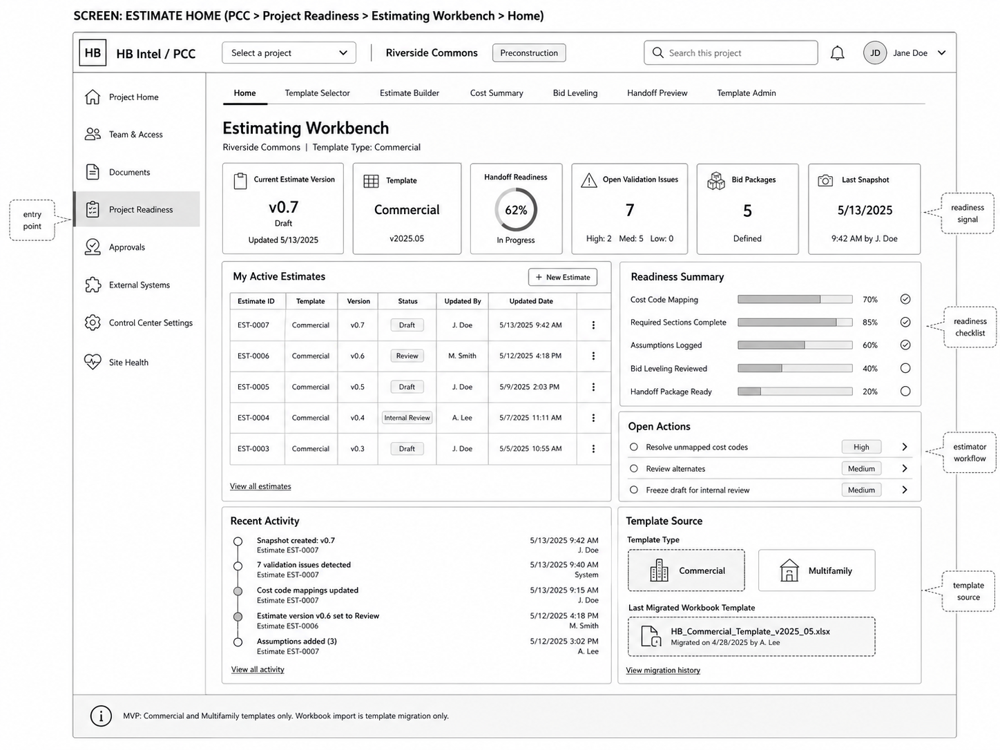

# 02 — Entry, Estimate Home, and Template Selector Wireframes

## Locked Decisions Applied

| Decision | Locked Direction |
|---|---|
| MVP posture | Estimating Workbench is included in MVP scope. |
| First implementation | SharePoint/SPFx inside PCC. |
| PCC placement | Mount under `Project Readiness > Estimating Workbench`; no new top-level PCC navigation surface in MVP. |
| Cost-code hierarchy | MVP uses internal HB Cost Codes first; Sage mapping follows in a future phase. |
| Day-one templates | Commercial and Multifamily. |
| Workbook import | Template migration only; no active project workbook import in MVP. |
| Data posture | Workbook-like UX over canonical PCC estimating data records. |
| HBI posture | Grounded review/summarization only; no pricing authority, no award authority. |

## Objective

Define the user entry point and template-start flow. This group orients users, shows readiness, and lets authorized estimators create or resume estimates without exposing raw SharePoint lists.

## Screens in This Group

1. Estimate Home / Dashboard.
2. My Active Estimates table.
3. Template Selector.
4. New Estimate start panel.
5. Template Source / Migration history panel.

## Visual Reference



## Screen 1: Estimate Home

### Purpose

Give the estimator and project team a single place to understand the current estimate version, template, validation state, bid package state, handoff readiness, and next actions.

### Primary Users

- Estimating Coordinator.
- Estimator.
- Lead Estimator.
- Project Executive.
- Project Manager.
- Project Accountant in read/review posture.

### Main Regions

```text
Estimating Workbench Home
├── KPI Cards
│   ├── Current Estimate Version
│   ├── Template
│   ├── Handoff Readiness
│   ├── Open Validation Issues
│   ├── Bid Packages
│   └── Last Snapshot
├── My Active Estimates
├── Readiness Summary
├── Open Actions
├── Recent Activity
└── Template Source
```

### KPI Card Requirements

| KPI | Required Fields | Action |
|---|---|---|
| Current Estimate Version | version, status, updated date | Open Estimate Builder. |
| Template | template type, template version | Open Template Selector / Template Source. |
| Handoff Readiness | percent, status | Open Handoff Preview. |
| Open Validation Issues | total, high/medium/low split | Open Validation Drawer. |
| Bid Packages | count, defined/reviewed status | Open Bid Leveling. |
| Last Snapshot | date/time, actor | Open Snapshot History. |

### My Active Estimates Table

| Column | Notes |
|---|---|
| Estimate ID | Stable ID, not display-only. |
| Template | Commercial or Multifamily. |
| Version | Current version label. |
| Status | Draft, Internal Review, Frozen Baseline, Superseded, Archived. |
| Updated By | Display name from project user context. |
| Updated Date | Project timezone display. |
| Row Menu | Open, duplicate draft, snapshot history, archive where authorized. |

### Readiness Summary

Required checklist rows:

- Cost Code Mapping.
- Required Sections Complete.
- Assumptions Logged.
- Bid Leveling Reviewed.
- Handoff Package Ready.

Each row shows percentage, icon state, and drill-in target.

### Open Actions

Open Actions must show only actionable items for the current user. Examples:

- Resolve unmapped cost codes.
- Review alternates.
- Freeze draft for internal review.
- Add missing required section.
- Review bid leveling package.

## Screen 2: Template Selector

### Purpose

Allow authorized users to start an estimate from a governed day-one template.

### Layout

```text
Template Selector
├── Template Type Cards
│   ├── Commercial
│   └── Multifamily
├── Template Version Panel
├── Seeded Sections Preview
├── Template Migration Source
├── Creation Settings
└── Create Estimate Button
```

### Template Type Cards

| Template | Day-One Status | Notes |
|---|---|---|
| Commercial | Enabled | Seeded from migrated commercial workbook template. |
| Multifamily | Enabled | Seeded from migrated multifamily workbook template. |
| Luxury Residential | Disabled / future | Do not show as selectable in MVP unless feature-flagged as future. |
| Environmental | Disabled / future | Do not show as selectable in MVP unless feature-flagged as future. |
| Municipal | Disabled / future | Do not show as selectable in MVP unless feature-flagged as future. |

### Creation Settings

- Estimate display name.
- Template version.
- Project stage.
- Copy sections from prior estimate? MVP default: no, unless explicit duplicate action.
- Include bid leveling seed packages? MVP default: yes for mapped bid packages.
- Include scratchpad sections? MVP default: yes, as empty allowed sections.

## Empty States

| State | UX |
|---|---|
| No estimate exists | Show Template Selector CTA and explanation. |
| No template source migrated | Show blocked setup state; Template Admin required. |
| User read-only | Show estimate list and readiness, hide create actions. |
| Active project is not Commercial/Multifamily | Show unsupported MVP project type message with future-state note. |

## Developer Notes

- Do not let users create estimates from ungoverned workbook uploads.
- New estimate creation must use a template version ID.
- Existing active workbook import is prohibited in MVP.
- Template selection is a governed config decision, not a free-form upload step.

## Acceptance Criteria

- User can start a Commercial or Multifamily estimate from the home screen.
- User cannot start an estimate from an unsupported template.
- Template source is visibly traceable to template migration history.
- Home screen communicates readiness without requiring users to open raw records.
