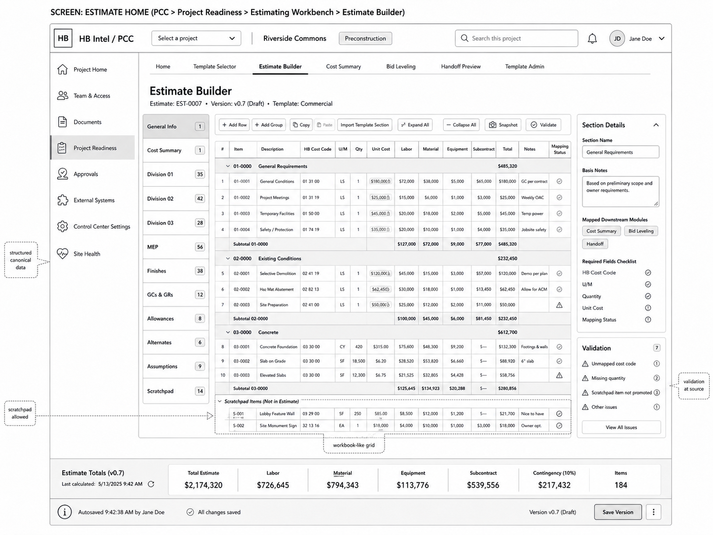

# 03 — Estimate Builder and Cost Summary Wireframes

## Locked Decisions Applied

| Decision | Locked Direction |
|---|---|
| MVP posture | Estimating Workbench is included in MVP scope. |
| First implementation | SharePoint/SPFx inside PCC. |
| PCC placement | Mount under `Project Readiness > Estimating Workbench`; no new top-level PCC navigation surface in MVP. |
| Cost-code hierarchy | MVP uses internal HB Cost Codes first; Sage mapping follows in a future phase. |
| Day-one templates | Commercial and Multifamily. |
| Workbook import | Template migration only; no active project workbook import in MVP. |
| Data posture | Workbook-like UX over canonical PCC estimating data records. |
| HBI posture | Grounded review/summarization only; no pricing authority, no award authority. |

## Objective

Define the workbook-like estimate-building experience while preserving canonical data quality. This is the core adoption screen and must feel familiar to estimators without becoming an uncontrolled spreadsheet clone.

## Screens in This Group

1. Estimate Builder.
2. Section Details side panel.
3. Scratchpad section.
4. Cost Summary.
5. GC/GR section.
6. Allowances and Alternates registers.
7. Assumptions / Inclusions / Exclusions / Qualifications registers.

## Visual Reference



## Screen 1: Estimate Builder

### Purpose

Allow estimators to build and refine estimate line items in a familiar grid while ensuring each promoted record is mapped to HB internal cost codes and downstream targets.

### Main Layout

```text
Estimate Builder
├── Section Navigator
├── Toolbar
├── Workbook-like Grid
├── Section Details Panel
├── Validation Panel
├── Estimate Totals Bar
└── Autosave / Save Version Footer
```

## Section Navigator

Required sections:

- General Info.
- Cost Summary.
- Division 01.
- Division 02.
- Division 03.
- MEP.
- Finishes.
- GCs & GRs.
- Allowances.
- Alternates.
- Assumptions.
- Scratchpad.

Each section row must show:

- section name;
- item count;
- validation status icon;
- active/selected state;
- hidden future ability to filter by status or issue count.

## Toolbar Actions

| Action | MVP Behavior |
|---|---|
| Add Row | Adds canonical draft line row to selected section. |
| Add Group | Adds grouped section heading/subtotal group. |
| Copy | Copies selected cell/row data to clipboard-compatible format. |
| Paste | MVP supports controlled paste into selected grid region only. |
| Import Template Section | Imports only from approved migrated template sections. |
| Expand All | Expands grouped rows. |
| Collapse All | Collapses grouped rows. |
| Snapshot | Creates estimate version snapshot. |
| Validate | Runs validation rule catalog. |

## Grid Columns

| Column | Required | Notes |
|---|---:|---|
| Row # | Yes | Display order. |
| Item | Yes | Line item identifier. |
| Description | Yes | Estimator-facing text. |
| HB Cost Code | Yes | Required before handoff. |
| U/M | Yes | Required if quantity or unit cost is used. |
| Qty | Conditional | Required for unit-priced rows. |
| Unit Cost | Conditional | Can be formula/result-supported in MVP. |
| Labor | Optional | Cost component. |
| Material | Optional | Cost component. |
| Equipment | Optional | Cost component. |
| Subcontract | Optional | Cost component. |
| Total | Yes | Calculated/resolved value. |
| Notes | Optional | Internal notes; sensitivity applies. |
| Mapping Status | Yes | Mapped / Warning / Error / Scratchpad / Excluded. |

## Grid Behavior

- Must support row grouping and subtotal rows.
- Must visually distinguish locked/calculated cells from editable cells.
- Must preserve keyboard-heavy operation.
- Must support copy/paste for controlled ranges.
- Must not attempt full Excel formula parity in MVP.
- Must show validation at the source row/cell where possible.
- Must support large row counts through virtualization or equivalent strategy before production-scale use.

## Scratchpad Behavior

Scratchpad items are allowed because estimator flexibility is required. However:

- Scratchpad items are not part of canonical estimate total unless promoted.
- Scratchpad rows must be visually distinct.
- Scratchpad rows can be promoted to canonical line items through explicit action.
- Scratchpad rows can be tagged as reference-only, deleted, or promoted.
- Handoff Preview must flag unpromoted scratchpad items.

## Section Details Panel

Fields:

- Section Name.
- Basis Notes.
- Mapped Downstream Modules.
- Required Fields Checklist.
- Section Owner.
- Last Edited By.
- Last Validated At.

Required downstream module chips:

- Cost Summary.
- Bid Leveling.
- Handoff.
- Buyout Seed.
- Budget Seed.

## Validation Panel

Minimum issue groups:

- Unmapped cost code.
- Missing quantity.
- Missing U/M.
- Invalid unit cost.
- Scratchpad item not promoted.
- Required section incomplete.
- Formula unsupported / resolved as static.

## Screen 2: Cost Summary

### Purpose

Show a controlled rollup of estimate totals by HB internal cost-code hierarchy and downstream target.

### Layout

```text
Cost Summary
├── Total Estimate Header
├── Cost Component Cards
│   ├── Labor
│   ├── Material
│   ├── Equipment
│   ├── Subcontract
│   ├── GCs & GRs
│   ├── Allowances
│   ├── Alternates
│   └── Contingency / Fee / Insurance / Bond / Tax
├── HB Cost Code Rollup Table
├── Variance / Warning Panel
└── Export / Snapshot Controls
```

### Required Rollup Columns

- HB Cost Code.
- HB Cost Code Description.
- CSI Reference, if mapped.
- Estimate Section.
- Labor.
- Material.
- Equipment.
- Subcontract.
- Total.
- Handoff Target.
- Validation Status.

## Screen 3: GC/GR

### Purpose

Preserve the workbook’s GC/GR assumptions in structured form without forcing rigid one-line cost entry.

Required sections:

- Staff / supervision assumptions.
- General conditions.
- Temporary facilities.
- Safety / protection.
- Equipment / logistics.
- Duration-based assumptions.
- Notes and basis of estimate.

## Acceptance Criteria

- Estimator can build a draft estimate without leaving the PCC shell.
- Grid supports familiar section-based workflow.
- Every promoted row can be validated against HB internal cost-code requirements.
- Scratchpad is clearly allowed but never silently becomes downstream data.
- Cost Summary derives from canonical rows, not uncontrolled spreadsheet formulas.
