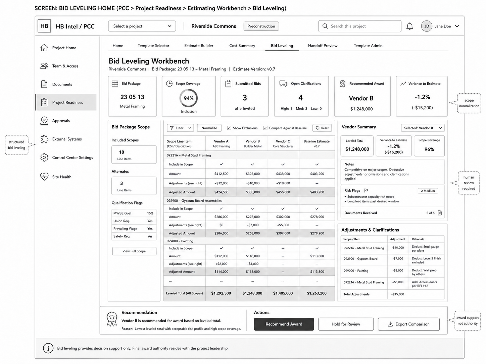

# 04 — Bid Leveling and Scope Normalization Wireframes

## Locked Decisions Applied

| Decision | Locked Direction |
|---|---|
| MVP posture | Estimating Workbench is included in MVP scope. |
| First implementation | SharePoint/SPFx inside PCC. |
| PCC placement | Mount under `Project Readiness > Estimating Workbench`; no new top-level PCC navigation surface in MVP. |
| Cost-code hierarchy | MVP uses internal HB Cost Codes first; Sage mapping follows in a future phase. |
| Day-one templates | Commercial and Multifamily. |
| Workbook import | Template migration only; no active project workbook import in MVP. |
| Data posture | Workbook-like UX over canonical PCC estimating data records. |
| HBI posture | Grounded review/summarization only; no pricing authority, no award authority. |

## Objective

Define the structured bid-leveling workflow for comparing vendor/subcontractor bids while preserving estimator judgment, adjustment rationale, and award-authority boundaries.

## Screens in This Group

1. Bid Leveling Workbench.
2. Bid Package Scope panel.
3. Vendor Summary panel.
4. Adjustments & Clarifications panel.
5. Export Comparison / Review modal.

## Visual Reference



## Screen: Bid Leveling Workbench

### Purpose

Normalize scope, compare bidders against estimate baseline, track clarifications and adjustments, and support award recommendation review without granting automatic award authority.

### Main Layout

```text
Bid Leveling Workbench
├── Summary Cards
├── Bid Package Scope Panel
├── Comparison Matrix
├── Vendor Summary Panel
├── Adjustments & Clarifications Panel
└── Recommendation / Action Bar
```

## Top Summary Cards

| Card | Required Content |
|---|---|
| Bid Package | CSI / package code, package title. |
| Scope Coverage | Percent included/normalized. |
| Submitted Bids | Count submitted vs. invited. |
| Open Clarifications | Count by severity. |
| Recommended Award | Human-entered or system-supported recommendation. |
| Variance to Estimate | Percent and dollar variance. |

## Bid Package Scope Panel

Required sections:

- Included scopes count.
- Alternates count.
- Qualification flags.
- Scope documents received.
- View Full Scope action.

Qualification flags examples:

- MWBE goal.
- Union requirement.
- Prevailing wage.
- Safety requirement.
- Insurance requirement.
- Long-lead material exposure.

## Comparison Matrix

### Required Columns

- Scope Line Item / CSI / Description.
- Vendor A.
- Vendor B.
- Vendor C.
- Baseline Estimate.

### Required Row Types

- Section header rows.
- Include-in-scope rows.
- Amount rows.
- Adjustment rows.
- Adjusted amount rows.
- Clarification rows.
- Subtotal rows.
- Leveled total row.

### Required Controls

- Filter.
- Normalize.
- Show Exclusions.
- Compare Against Baseline.
- Reset.
- Export Comparison.

## Vendor Summary Panel

Must show:

- selected vendor;
- leveled total;
- variance to estimate;
- scope coverage;
- notes;
- risk flags;
- documents received;
- clarification status;
- qualification exceptions.

## Adjustments & Clarifications Panel

Each adjustment row must include:

- scope/item reference;
- adjustment amount;
- rationale;
- source/clarification reference;
- created by;
- status;
- whether adjustment affects recommendation.

## Recommendation / Action Bar

Actions:

- Recommend Award.
- Hold for Review.
- Export Comparison.

Required guardrail text:

> Bid leveling provides decision support only. Final award authority resides with project leadership.

## Award Authority Guardrail

The UI may support a recommendation. It must not:

- execute an award;
- create a commitment;
- write back to Sage;
- write back to Procore;
- make HBI the authority for award selection;
- hide incomplete scope coverage.

## Review States

| State | UI Behavior |
|---|---|
| No bids submitted | Show bid package shell and invite/submission placeholder. |
| Bids submitted but not normalized | Prompt Normalize Scope. |
| Missing documents | Flag vendor summary. |
| Clarifications open | Disable final recommendation unless role override allows review hold. |
| Recommendation complete | Allow export/handoff to Handoff Preview. |

## Acceptance Criteria

- User can compare at least three vendors against a baseline estimate.
- Adjustments are visible and rationale-backed.
- Scope inclusion/exclusion is explicit.
- Recommendation support is visibly not award authority.
- Bid Leveling Reviewed readiness signal feeds Estimate Home and Handoff Preview.
