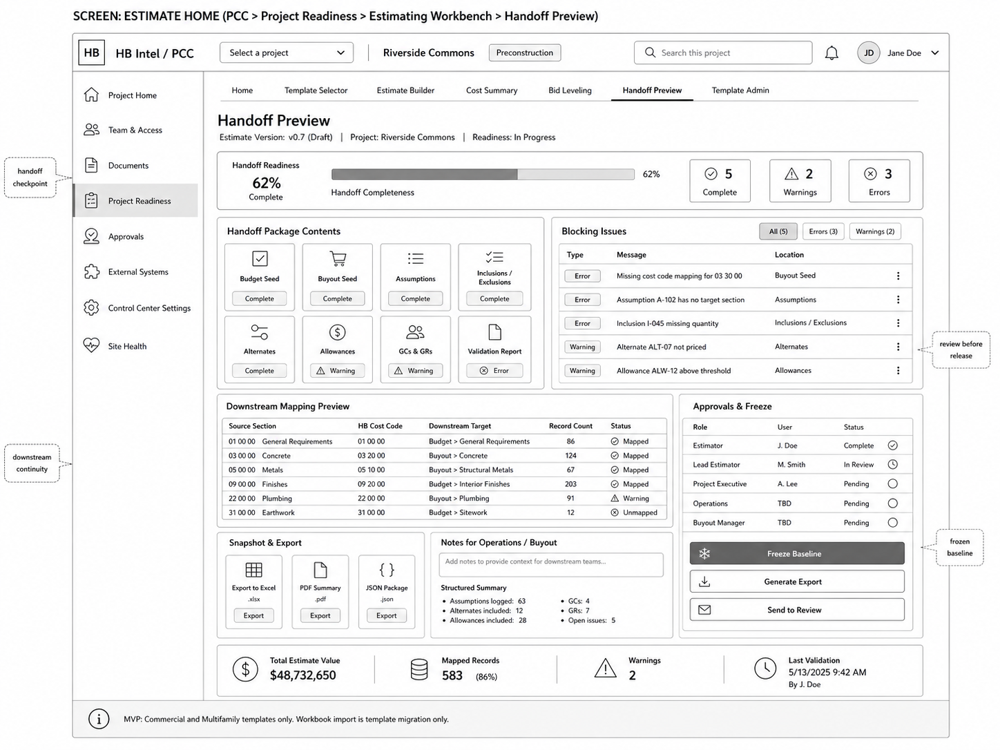

# 05 — Handoff Preview, Freeze, and Export Wireframes

## Locked Decisions Applied

| Decision | Locked Direction |
|---|---|
| MVP posture | Estimating Workbench is included in MVP scope. |
| First implementation | SharePoint/SPFx inside PCC. |
| PCC placement | Mount under `Project Readiness > Estimating Workbench`; no new top-level PCC navigation surface in MVP. |
| Cost-code hierarchy | MVP uses internal HB Cost Codes first; Sage mapping follows in a future phase. |
| Day-one templates | Commercial and Multifamily. |
| Workbook import | Template migration only; no active project workbook import in MVP. |
| Data posture | Workbook-like UX over canonical PCC estimating data records. |
| HBI posture | Grounded review/summarization only; no pricing authority, no award authority. |

## Objective

Define the governance screen that turns estimator work into downstream PCC data. This is the key bridge between estimating flexibility and structured project execution continuity.

## Screens in This Group

1. Handoff Preview.
2. Blocking Issues table.
3. Downstream Mapping Preview.
4. Approvals & Freeze panel.
5. Snapshot & Export panel.
6. Notes for Operations / Buyout panel.

## Visual Reference



## Screen: Handoff Preview

### Purpose

Validate, review, freeze, and export the estimate handoff package before downstream use by operations, buyout, project controls, and PCC readiness modules.

### Main Layout

```text
Handoff Preview
├── Readiness Banner
├── Handoff Package Contents
├── Blocking Issues
├── Downstream Mapping Preview
├── Approvals & Freeze
├── Snapshot & Export
├── Notes for Operations / Buyout
└── Footer Summary Strip
```

## Readiness Banner

Must include:

- Handoff readiness percentage.
- Progress bar.
- complete/warning/error counts.
- current estimate version.
- readiness state.

Readiness state values:

- Not Started.
- In Progress.
- Ready for Review.
- Review Returned.
- Approved for Freeze.
- Frozen Baseline.
- Superseded.

## Handoff Package Contents

Checklist cards:

- Budget Seed.
- Buyout Seed.
- Assumptions.
- Inclusions / Exclusions.
- Alternates.
- Allowances.
- GCs & GRs.
- Validation Report.

Each card has status:

- Complete.
- Warning.
- Error.
- Not Applicable.
- Not Started.

## Blocking Issues

Required fields:

- Type.
- Severity.
- Message.
- Location.
- Owner.
- Required action.
- Blocking handoff? yes/no.
- Open related section action.

Handoff must be blocked by:

- missing HB cost-code mapping for required canonical rows;
- missing required quantity/U/M where applicable;
- unresolved required assumptions target;
- unreviewed bid leveling package if included in readiness criteria;
- missing budget seed mapping;
- missing buyout seed mapping;
- unresolved fatal validation report.

## Downstream Mapping Preview

Required columns:

- Source Section.
- HB Cost Code.
- Downstream Target.
- Record Count.
- Status.

Downstream target values:

- Budget Seed.
- Buyout Seed.
- Responsibility Matrix candidate.
- Constraints candidate.
- Assumptions register.
- Allowances register.
- Alternates register.
- Handoff attachment/export.

## Approvals & Freeze Panel

Required roles:

- Estimator.
- Lead Estimator.
- Project Executive.
- Operations / Project Manager.
- Buyout Manager or Procurement reviewer.

Actions:

- Send to Review.
- Generate Export.
- Freeze Baseline.
- Return for Correction.

Freeze Baseline must be disabled until blocking errors are resolved and required approvals are complete.

## Snapshot & Export

Export cards:

- Excel export (`.xlsx`) — convenience/reference output.
- PDF summary (`.pdf`) — review/leadership summary.
- JSON package (`.json`) — canonical handoff package for downstream modules/fixtures.

Exports must be generated from canonical records, not from uncontrolled workbook formulas.

## Notes for Operations / Buyout

The handoff note must include:

- free-text note box;
- structured summary;
- assumptions count;
- alternates count;
- allowances count;
- GC/GR count;
- open issues count;
- downstream visibility flag.

## Footer Summary Strip

Required metrics:

- total estimate value;
- mapped records count and percentage;
- warnings count;
- last validation timestamp and actor.

## Acceptance Criteria

- User can see exactly what will move downstream before freeze.
- Frozen Baseline cannot be created with blocking errors.
- Exports are clearly secondary to canonical handoff data.
- Operations/buyout notes are captured before handoff release.
- Handoff state updates feed Estimate Home readiness.
