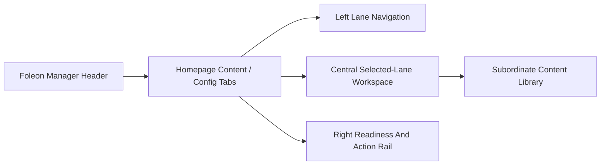

# Foleon Manager UX Rebuild Design Brief

## Product Intent

Foleon Manager is a SharePoint-hosted admin workspace for marketing and operations users who manage homepage Foleon content. It should help users understand which homepage lane is live, what is staged, what is blocked, what needs placement work, and what action comes next.

The surface must feel like an HB Intel operations console, not a technical diagnostics page and not a generic enterprise card grid.

## Design Direction

Tone: refined operational, editorial-admin, confident, and clear.

The visual system should express:
- Full page-canvas confidence inside SharePoint.
- Strong lane ownership for Project Spotlight, Company Pulse, and Leadership Message.
- A clear selected-lane working area.
- A readiness/action rail that helps users publish or understand blockers.
- Technical Config access that is present but not dominant.

The design must not create fake SharePoint chrome, duplicate navigation, or compete with the host shell.

## Required First-Pass Structural Replacement

The first implementation pass must replace the current centered stacked-card shell with this structure:

Required desktop posture:
- Left: lane navigation and lane status list.
- Center: selected lane workspace with current live edition, staged/draft content, display window, validation, and placement context.
- Right: publish readiness, placement status, API/write/sync availability, and next actions.
- Below: content library as secondary support, not the main visual mass.

This must not be implemented as another vertical stack of metric cards, lane cards, editor card, placement card, and library card.

## Limited Mode Design

Limited mode is a designed product state.

When API consent or read path is unavailable:
- Keep the Manager canvas, lane navigation, selected-lane workspace, readiness rail, and library placeholder structure visible.
- Explain that read, write, and sync are unavailable until API access is approved.
- Disable blocked actions honestly and provide nearby explanations.
- Avoid zero-count metric dominance.
- Avoid raw technical failure text in primary UI.
- Keep redacted technical proof available in Config diagnostics.

The user should understand what the Manager will do once access is approved.

## Config Tab Design

Config is an admin console. It should not dominate the first view.

Required sections:
- Required admin actions.
- System health.
- API approval and token state.
- SharePoint list bindings.
- Package/manifest governance.
- Collapsed diagnostics.

Raw technical names remain hidden unless diagnostics are expanded.

## Premium Stack Use

Use the approved stack for visible utility:
- `motion/react`: restrained section transitions and selected-lane changes, with reduced-motion support.
- `lucide-react`: operational icons for lanes, readiness, sync, diagnostics, blocked/valid/warning state.
- `@radix-ui/react-tooltip`: micro-help for compact status and disabled action reasons.
- `@radix-ui/react-separator`: rhythm between workspace sections.
- `@radix-ui/react-scroll-area`: lane/library overflow in constrained states.
- `class-variance-authority`: lane, readiness, status, and panel variants.
- `clsx`: readable class composition.
- `@hbc/ui-kit/homepage`: governed button/primitive entrypoint where appropriate.

Do not import any package symbolically. Every added import must support visible or testable behavior.

## Measurable Visual Acceptance Criteria

The rebuild is not acceptable unless all of the following are true:
- At 100% desktop zoom, the page visibly uses the available SharePoint content width and reads as a workspace, not a narrow centered rail.
- The first screen shows the admin hierarchy: header actions, lane navigation, selected-lane workspace, readiness/action rail.
- The content library is visually subordinate to lane management.
- Limited mode still looks composed and useful, with lane structure and clear API approval messaging.
- Config is secondary and technical by default, with diagnostics collapsed.
- The before/after is obvious in screenshots without inspecting code.
- Primary actions are reachable at desktop, tablet/narrow, phone portrait, and short-height captures.
- No hard-stop failures remain: no generic card-grid outcome, no deceptive/dead actions, no critical accessibility failure, no weak hosted/package proof.

## Validation Expectations

Implementation must close with:
- Updated tests for workspace shell, lane navigation, selected-lane workspace, limited mode, Config default, disabled explanations, keyboard behavior, no raw diagnostics in primary UI, and layout markers.
- Required command results for lint, typecheck, test, schema validation, and build.
- Package/manifest version bump using four-part SharePoint format.
- Hosted proof object, loaded JS/CSS asset names, package version, manifest/component ID, route/properties proving `foleonRoute=manage`, and relevant console review.
- Screenshots for desktop, 75% wide capture, tablet/narrow, short-height/constrained, limited mode, and Config tab.
- Final closure report with full 14-category scorecard and explicit exceptions, if any.
