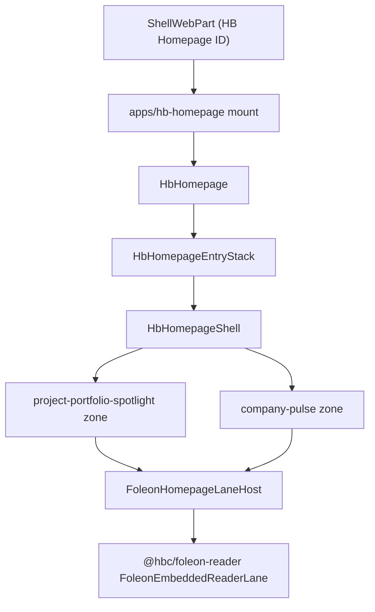

# 02 — Implementation Plan

## Strategy

Use Strategy A: Shared React Component Integration.

Do not call or load `window.__hbIntel_foleon`. Do not mount the Foleon IIFE twice. Do not use the Foleon app global mount. Render `@hbc/foleon-reader` directly inside the homepage React tree.

## High-Level Flow

## Planned File Changes

Package dependencies/config:

- `apps/hb-webparts/package.json` — add `@hbc/foleon-reader` dependency.
- `apps/hb-webparts/tsconfig.json` and `apps/hb-webparts/vite.config.ts` if needed — add package alias only if workspace resolution does not already work.
- `apps/hb-homepage/package.json`, `apps/hb-homepage/tsconfig.json`, and `apps/hb-homepage/vite.config.ts` only if required by the build graph. The homepage runtime aliases `@hb-homepage/runtime` to `hb-webparts`, so the dependency may only need to live in `hb-webparts`.

Homepage config/property seam:

- `tools/spfx-shell/src/webparts/shell/ShellWebPart.ts`
- `tools/spfx-shell/src/webparts/shell/foleonRuntimeConfigBridge.ts`, or a new homepage-specific bridge module if cleaner.
- `apps/hb-homepage/src/mount.tsx`
- `apps/hb-webparts/src/webparts/hbHomepage/hbHomepageContract.ts`
- `apps/hb-webparts/src/webparts/hbHomepage/shell/shellTypes.ts`
- `apps/hb-webparts/src/webparts/hbHomepage/shell/shellSchema.ts`
- `apps/hb-webparts/src/webparts/hbHomepage/shell/shellValidation.ts`

Foleon lane host and zone replacement:

- `apps/hb-webparts/src/webparts/hbHomepage/zones/FoleonHomepageLaneHost.tsx`
- `apps/hb-webparts/src/webparts/hbHomepage/zones/FoleonHomepageLaneHost.module.css` if wrapper fit CSS is needed.
- `apps/hb-webparts/src/webparts/hbHomepage/zones/ProjectPortfolioSpotlightZone.tsx`
- `apps/hb-webparts/src/webparts/hbHomepage/zones/CompanyPulseZone.tsx`

Tests:

- add/update files under `apps/hb-webparts/src/webparts/hbHomepage/__tests__`
- add/update shell tests under `apps/hb-webparts/src/webparts/hbHomepage/shell/__tests__`
- add package authority expectations if version changes.

Version/package:

- `apps/hb-homepage/config/package-solution.json`
- `apps/hb-homepage/src/webparts/hbHomepage/HbHomepageWebPart.manifest.json`
- `apps/hb-webparts/src/webparts/hbHomepage/HbHomepageWebPart.manifest.json`
- `packages/homepage-launcher/src/constants.ts`
- e2e expected launcher version files if still present in repo truth.

## Implementation Steps

1. Add `@hbc/foleon-reader` to the homepage runtime dependency graph.
2. Add homepage-specific Foleon config parsing and typing.
3. Add `FoleonHomepageLaneHost`.
4. Replace `ProjectPortfolioSpotlightZone` and `CompanyPulseZone` internals with lane host calls while preserving `ZoneErrorBoundary`.
5. Wire content-state reporting from the lane host.
6. Add tests for zone wiring, config mapping, content states, protected layout, and package authority.
7. Bump homepage version coherently if required by the execution baseline.
8. Run validation and package proof.
9. Commit the scoped Wave 02 cutover.

## Things Not To Change

- Do not add occupant IDs.
- Do not change default preset row composition.
- Do not change protected row pairings.
- Do not change hero or Priority Actions launcher.
- Do not touch Safety, Kudos, PnP Ops, Leadership, People, or unrelated shell code except tests that prove they remain valid.
- Do not modify tenant lists.
