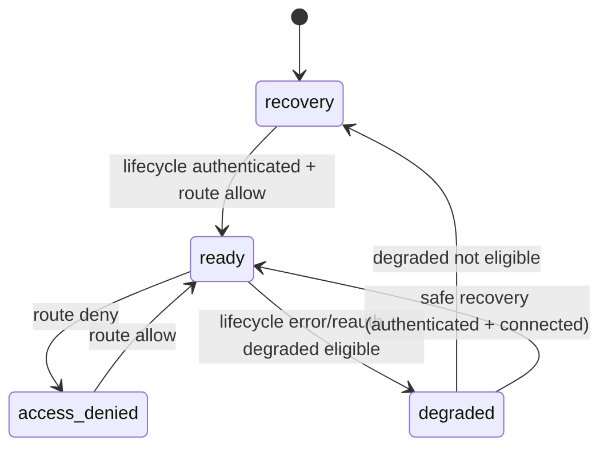

# Auth/Shell Store Contracts and State Diagrams

- **Status:** Canonical reference
- **Date:** 2026-03-06

## Auth Store Contract Summary

Auth store owns centralized state for:

- lifecycle phase (`idle`, `bootstrapping`, `restoring`, `authenticated`, `signed-out`, `reauth-required`, `error`)
- normalized session and runtime mode
- restore state and shell bootstrap readiness
- structured failures and compatibility fields

Selector contracts provide scoped reads for lifecycle, bootstrap readiness, session summary,
and permission summary to limit rerender fan-out.

## Shell Store Contract Summary

Shell stores own centralized shell concerns for:

- active workspace/navigation shell state
- shell experience state and bootstrap phase
- shell-status snapshot derivation inputs
- degraded/recovery communication state

Auth and shell stores are intentionally separated to preserve package boundaries.

## Auth Lifecycle State Diagram

```mermaid
stateDiagram-v2
  [*] --> idle
  idle --> bootstrapping : beginBootstrap
  bootstrapping --> authenticated : completeBootstrap(session)
  bootstrapping --> signed-out : completeBootstrap(no session)
  authenticated --> restoring : beginRestore
  restoring --> authenticated : resolveRestore(restored)
  restoring --> reauth-required : resolveRestore(reauth-required)
  restoring --> signed-out : resolveRestore(invalid-expired)
  restoring --> error : resolveRestore(fatal)
  authenticated --> signed-out : signOut
  reauth-required --> authenticated : signInSuccess
  error --> idle : clear/restore
```

## Shell Experience State Diagram



## Shell-Status Priority Hierarchy

Priority order (highest wins):

1. `error-failure`
2. `access-validation-issue`
3. `restoring-session`
4. `initializing`
5. `degraded`
6. `recovered`
7. `reconnecting`
8. `connected`

This prevents conflicting status messages and preserves deterministic status actions.

## Startup Timing State Contract

Startup phase taxonomy and budgets:

- runtime-detection: 100ms
- auth-bootstrap: 800ms
- session-restore: 500ms
- permission-resolution: 200ms
- first-protected-shell-render: 1500ms

Budget validation is non-blocking at runtime and used as release evidence.

## Traceability

- Plans: PH5.3, PH5.5, PH5.6, PH5.7, PH5.15
- ADRs: ADR-0056, ADR-0058, ADR-0059, ADR-0060, ADR-0068
