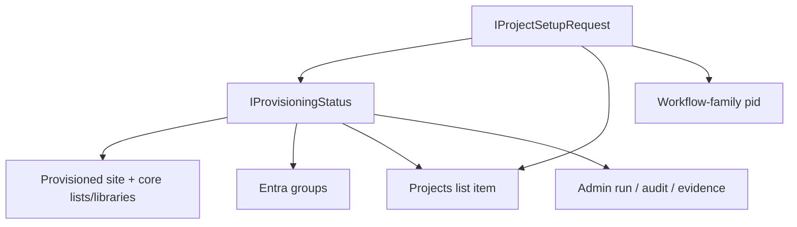

# 06 — Shared Data and Source-of-Truth Map

## Shared data entities

| Entity / record | Primary authoritative owner | Consumed by | Access pattern | Classification |
|---|---|---|---|---|
| `IProjectSetupRequest` | Project Setup domain / Project Setup host | Estimating, Accounting, Admin (indirect ops context) | API | Confirmed repo fact |
| `IProvisioningStatus` | Project Setup domain / Project Setup host | Estimating, Accounting, Admin | API | Confirmed repo fact |
| `ISagaStepResult[]` | Project Setup domain / saga host | Estimating, Admin | API / event-derived UI | Confirmed repo fact |
| `IProvisioningAuditRecord` | Project Setup backend audit layer | backend/admin contexts | backend | Confirmed repo fact |
| Admin run envelope + audit/evidence records | Admin Control Plane | Admin | API + durable tables | Confirmed repo fact |
| HBCentral `Projects` list item | SharePoint / project registry read model | Project Sites directly; other subset apps indirectly | SharePoint list query | Confirmed repo fact |
| `pid` field on workflow-family lists | SharePoint workflow-family list schemas | backend/app queries | SharePoint list storage | Confirmed authoritative doc |
| Entra group IDs / membership set (`IEntraGroupSet`) | provisioning status + Entra ID | backend, admin diagnostics | API + Graph | Confirmed repo fact |
| Core site libraries/lists | provisioned project site | project teams, site consumers | SharePoint | Confirmed authoritative doc |

## Cross-app data model map

## Field-level overlap that matters most

| Business concept | Project Setup request | Provisioning status | Projects list read model | Workflow-family lists | Ownership assessment |
|---|---|---|---|---|---|
| `projectId` | yes | yes | yes (`field_1`) | no | primarily workflow/API identity |
| `projectNumber` | optional/assigned | yes | yes (`field_2`) | yes via `pid` | primary cross-system human key |
| `projectName` | yes | yes | yes (`field_3` / `Title`) | indirect | stable business label |
| `department` | yes | yes | yes (`field_12`) | family logic / background access | mixed business/config concern |
| `siteUrl` | may appear post-completion | yes | yes (`field_23`) | no | site-read-model concern |
| `year` | yes (explicitly tied to Projects list) | not primary run field | yes (`Year`) | no | Projects-list-facing read-model attribute |
| group membership / group IDs | request has intended members; status has created groups | yes | no | no | provisioning + identity concern |

## Identifier strategy currently in repo

### `projectId`
- UUID-based system identity
- used in provisioning APIs, statuses, SignalR grouping, and backend partitioning
- also mirrored into the `Projects` list read model

### `projectNumber`
- human/business identity
- used for display, site naming, group naming, and cross-list joins

### `pid`
- SharePoint workflow-list join key
- explicitly stores the `projectNumber`, not the UUID
- required and indexed on workflow-family lists

## Source-of-truth assessment

| Data concern | Current best reading of truth boundary | Assessment |
|---|---|---|
| Request lifecycle truth | Project Setup API/domain | clear |
| Provisioning runtime truth | Project Setup API/domain | clear |
| Site directory / year-filtered discovery truth | `Projects` list read model | clear for read path, less clear for upstream write ownership |
| Workflow-family list correlation key | `pid = projectNumber` contract | clear |
| Unified project identity doctrine across all four apps | distributed across request, status, Projects list, and pid docs | under-documented at subset level |

## Best evidence-backed interpretation

The HBCentral `Projects` list should be treated as an **intentional shared read model / registry projection** for this subset, not as the primary lifecycle owner of requests or provisioning status.

## Governance gap

The repo currently documents pieces of the identity strategy, but it does not yet publish one focused four-app source-of-truth table that says:
- where `projectId` originates
- where `projectNumber` becomes authoritative
- when `siteUrl` becomes authoritative
- who writes the `Projects` list projection
- which fields on that list are guaranteed current for Project Sites

That gap should be closed.
