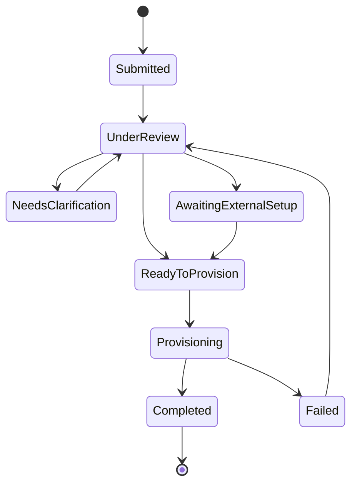

# @hbc/provisioning

Headless provisioning lifecycle, API client, state machine, and cross-module contracts for HB Intel project setup.

**Relationship to admin control-plane contracts**: This package retains its own domain-specific types (`IProvisioningStatus`, `IProjectSetupRequest`, state machine, BIC config, display registries). The generalized admin control-plane contracts in `@hbc/models/admin-control-plane` are a **translation target**, not a replacement. Provisioning data is projected into the generalized model at the display boundary (Phase 5 adapter). See the [run model crosswalk](../../docs/architecture/plans/MASTER/spfx/admin/phase-02/admin-control-plane-run-model.md) and [package placement map](../../docs/architecture/plans/MASTER/spfx/admin/phase-02/admin-control-plane-package-placement-and-boundary-map.md).

**Locked ADR:** ADR-0077 — `docs/architecture/adr/ADR-0077-provisioning-package-boundary.md`

---

## Overview

`@hbc/provisioning` owns the entire project-setup-request lifecycle — from guided submission through controller review, external setup, automated provisioning, and handoff to Project Hub. It is a **headless** package: no visual React component exports (D-PH6-09). Surfaces compose this package's API client, state machine, BIC config, and registry data through their own UI layer.

---

## Installation

This package is internal to the HB Intel monorepo. Add it as a workspace dependency:

```json
{
  "dependencies": {
    "@hbc/provisioning": "workspace:*"
  }
}
```

Peer dependencies: `react ^18`, `zustand ^5`.

---

## Quick Start

```typescript
import { createProvisioningApiClient } from '@hbc/provisioning';

// 1. Create an API client
const api = createProvisioningApiClient('https://api.example.com', getToken);

// 2. Submit a request
const request = await api.submitRequest({ projectName: 'New Tower', department: 'commercial' });

// 3. List requester's own submissions (G5-T01)
const myRequests = await api.listMyRequests('user@example.com');

// 4. Check handoff readiness
import { validateSetupHandoffReadiness, resolveProjectHubUrl } from '@hbc/provisioning';

const error = validateSetupHandoffReadiness(request);
if (!error) {
  const hubUrl = resolveProjectHubUrl(request); // → SharePoint site URL or null
}
```

---

## State Machine



Use `isValidTransition(from, to)` to validate transitions programmatically.

---

## Exports

| Export | Kind | Description |
|--------|------|-------------|
| `IProvisioningApiClient` | Interface | Full API client contract |
| `IProjectHubSeedData` | Interface | Seed data planted into Project Hub at handoff |
| `SummaryFieldSource` | Type | `'request' \| 'bic' \| 'provisioning'` |
| `ISummaryFieldDescriptor` | Interface | Summary field definition with tier gating |
| `IUrgencyIndicator` | Interface | Urgency tier visual indicator config |
| `HistoryLevel` | Type | History detail level identifier |
| `IHistoryContentDescriptor` | Interface | History content definition with level gating |
| `ICoachingPrompt` | Interface | Contextual coaching prompt descriptor |
| `IIntegrationRule` | Interface | External integration rule descriptor |
| `IFailureMode` | Interface | Provisioning failure mode descriptor |
| `createProvisioningApiClient` | Factory | Creates authenticated API client instance |
| `useProvisioningStore` | Hook | Zustand store for provisioning state |
| `useProvisioningSignalR` | Hook | SignalR real-time provisioning updates |
| `isValidTransition` | Function | State machine transition validator |
| `STATE_TRANSITIONS` | Constant | From-state → allowed-next-states map |
| `STATE_NOTIFICATION_TARGETS` | Constant | State → notification recipient groups |
| `PROJECT_SETUP_BIC_CONFIG` | Constant | BIC ownership configuration |
| `deriveCurrentOwner` | Function | Derives current BIC owner from request state |
| `BIC_ROLE_CONTROLLER` | Constant | Role identifier for controller |
| `BIC_ROLE_REQUESTER` | Constant | Role identifier for requester |
| `BIC_ROLE_ADMIN` | Constant | Role identifier for admin |
| `BIC_ROLE_PROJECT_LEAD` | Constant | Role identifier for project lead |
| `createProjectSetupBicRegistration` | Factory | BIC module registration for project setup |
| `SETUP_TO_PROJECT_HUB_HANDOFF_CONFIG` | Constant | Handoff config: Estimating → Project Hub |
| `validateSetupHandoffReadiness` | Function | Pre-flight handoff validation |
| `resolveProjectHubUrl` | Function | Resolves Project Hub URL from completed request (G5-T05) |
| `PROJECT_SETUP_STATUS_LABELS` | Constant | PascalCase state → display label map |
| `DEPARTMENT_DISPLAY_LABELS` | Constant | Department slug → display label map |
| `URGENCY_INDICATOR_MAP` | Constant | BIC urgency tier → visual indicator map |
| `PROJECT_SETUP_SUMMARY_FIELDS` | Constant | Ordered summary field registry |
| `CORE_SUMMARY_FIELD_IDS` | Constant | Ungated field IDs (no tier gate) |
| `STATE_BADGE_VARIANTS` | Constant | State → badge variant map |
| `getStateBadgeVariant` | Function | Lookup badge variant by state |
| `REQUEST_STATE_KEBAB_MAP` | Constant | PascalCase → kebab-case state map (G5-T02) |
| `isSummaryFieldVisible` | Function | Complexity-gated field visibility check |
| `getVisibleSummaryFields` | Function | Filter fields by complexity tier |
| `isHistoryContentVisible` | Function | History content visibility check |
| `getVisibleHistoryContent` | Function | Filter history content by level |
| `IRecoveryGuidance` | Interface | P7-05: Structured recovery guidance for failed runs |
| `RecoveryAction` | Type | P7-05: Recommended recovery action enum |
| `IPrelaunchFailure` | Interface | P7-03: Single prelaunch validation failure |
| `IPrelaunchValidationResult` | Interface | P7-03: Aggregated prelaunch validation result |
| `PrelaunchFailureCategory` | Type | P7-03: Failure category for grouping |
| `IProvisioningEvidence` | Interface | P7-06: Structured run evidence payload |
| `IStepEvidence` | Interface | P7-06: Per-step execution evidence |
| `IPermissionPosture` | Interface | P7-06: Permission posture at saga start |
| `ProvisioningFailureClass` | Type | P7-04: Backend-assigned failure classification |

---

## Architecture Boundaries

This package **must not**:

- Export visual React components (ADR-0077, D-PH6-09)
- Import from `@hbc/ui-kit` (headless boundary)
- Import from feature packages (e.g., `@hbc/my-work-feed`)

Dependencies (allowed): `@hbc/models`, `@hbc/auth`, `@hbc/bic-next-move`, `@hbc/complexity`, `@hbc/notification-intelligence`, `@hbc/workflow-handoff`.

Verify boundary:

```bash
grep -r "from '@hbc/ui-kit'" packages/provisioning/src/    # expect 0 matches
```

---

## State Naming Conventions

| PascalCase (internal) | kebab-case (G5 parity) | Display Label |
|---|---|---|
| `Submitted` | `submitted` | Submitted |
| `UnderReview` | `under-review` | Under Review |
| `NeedsClarification` | `clarification-needed` | Clarification Needed |
| `AwaitingExternalSetup` | `awaiting-external-setup` | Awaiting External Setup |
| `ReadyToProvision` | `ready-to-provision` | Queued for Provisioning |
| `Provisioning` | `provisioning` | Provisioning |
| `Completed` | `completed` | Completed |
| `Failed` | `failed` | Failed |

Use `REQUEST_STATE_KEBAB_MAP` for PascalCase→kebab conversions and `PROJECT_SETUP_STATUS_LABELS` for display.

---

## Running Tests

```bash
pnpm --filter @hbc/provisioning test           # unit + coverage
pnpm --filter @hbc/provisioning check-types    # TypeScript
pnpm --filter @hbc/provisioning lint           # ESLint
pnpm --filter @hbc/provisioning build          # Vite production build
```

---

## Phase 7 Client Enhancements

### Recovery guidance

`client.getRecoveryGuidance(projectId)` fetches structured recovery guidance for a failed run. The backend returns an `IRecoveryGuidance` payload with:

- `retryAdvisable` — whether retry is likely to succeed
- `recommendedAction` — primary action: `'retry'`, `'escalate'`, `'investigate-permissions'`, `'fix-configuration'`, `'wait-and-retry'`
- `failureSummary`, `likelyCause`, `nextStep` — operator-facing explanations
- `escalationReason` — when escalation is more appropriate than retry
- `runbookRef` — relevant runbook section reference

### Failure classification

`IProvisioningStatus.failureClass` is now populated by the backend on every failure. Values: `'transient'`, `'structural'`, `'permissions'`, `'repeated'`, `'admin-class'`. The client returns this field via `getProvisioningStatus()` and `listProvisioningRuns()`.

### Evidence payload

`IProvisioningStatus.evidence` contains structured run evidence (`IProvisioningEvidence`) captured at saga terminal states. Includes per-step timing, attempt counts, permission posture, and failure details.

### Prelaunch validation

The `POST /api/provision-project-site` endpoint returns HTTP 422 with an `IPrelaunchValidationResult` when prerequisites are not satisfied. The client's `ApiError` carries the status code (422) and code (`PRELAUNCH_VALIDATION_FAILED`) for callers that need to distinguish validation failures from other errors.

---

## Related Plans & References

- ADR-0077 — Provisioning Package Boundary
- ADR-0076 — Project Identifier Model
- ADR-0082 — SharePoint Docs Pre-Provisioning Storage
- ADR-0090 — SignalR Per-Project Groups
- `docs/architecture/plans/MVP/G3/` — Shared platform wiring (BIC, handoff, registries)
- `docs/architecture/plans/MVP/G4/` — SPFx controller/admin surfaces
- `docs/architecture/plans/MVP/G5/` — Hosted PWA requester surfaces
