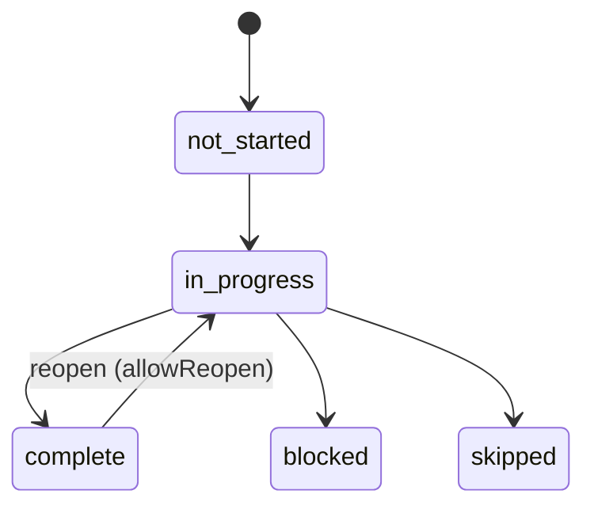

# @hbc/step-wizard

Multi-step guided workflow primitive for HB Intel.

Provides a configurable step-wizard engine with a declarative configuration pattern (`IStepWizardConfig<T>`), a state machine that derives runtime state from config + draft, and visual components composed from `@hbc/ui-kit`. Wizard progress is persisted via `@hbc/session-state` with monotonic draft merging — step statuses never regress and terminal states always win.

Sequential-mode navigation preserves an explicit active step in the draft so Back and revisiting prior completed steps work without regressing completion state.

## Installation

```bash
pnpm add @hbc/step-wizard
```

### Peer dependencies

| Package     | Version  |
|-------------|----------|
| `react`     | `^18.3`  |
| `react-dom` | `^18.3`  |

## Step configuration pattern

Define a wizard by creating an `IStepWizardConfig<T>` where `T` is your domain record type:

```ts
import type { IStepWizardConfig } from '@hbc/step-wizard';

const projectSetupWizardConfig: IStepWizardConfig<IProjectSetupRequest> = {
  title: 'New Project Setup',
  orderMode: 'sequential',
  allowReopen: true,
  draftKey: (item) => `project-setup-${item.requestId}`,
  steps: [
    {
      stepId: 'details',
      label: 'Project Details',
      required: true,
      order: 1,
      validate: (draft) => (!draft.projectName ? 'Project name is required' : null),
      resolveAssignee: () => ({ userId: '...', displayName: 'Requester', role: 'requester' }),
    },
    {
      stepId: 'team',
      label: 'Team Members',
      required: true,
      order: 2,
      resolveAssignee: () => ({ userId: '...', displayName: 'Project Lead', role: 'lead' }),
    },
    {
      stepId: 'review',
      label: 'Final Review',
      required: false,
      order: 3,
    },
  ],
};
```

### `IStepWizardConfig<T>` fields

| Field | Type | Required | Description |
|-------|------|----------|-------------|
| `title` | `string` | yes | Wizard display title |
| `steps` | `IStep<T>[]` | yes | Step definitions |
| `orderMode` | `StepOrderMode` | yes | `'sequential'`, `'parallel'`, or `'sequential-with-jumps'` |
| `allowReopen` | `boolean` | no | Whether completed steps can be reopened — resets `onAllCompleteFired` |
| `allowForceComplete` | `boolean` | no | Whether required steps can skip validation via `force` flag |
| `onAllComplete` | `(item: T) => void \| Promise<void>` | no | Fires once when all required steps complete; guarded by `onAllCompleteFired` idempotency flag |
| `draftKey` | `string \| ((item: T) => string)` | no | `@hbc/session-state` persistence key; use a function for per-record uniqueness |

### `IStep<T>` fields

| Field | Type | Required | Description |
|-------|------|----------|-------------|
| `stepId` | `string` | yes | Unique stable key — must not change across remounts |
| `label` | `string` | yes | Display label for sidebar and progress |
| `icon` | `string` | no | Icon key from `@hbc/ui-kit` icon set |
| `required` | `boolean` | yes | Whether step must complete for wizard completion |
| `order` | `number` | no | 1-based display order (sequential modes) |
| `resolveAssignee` | `(item: T) => IBicOwner \| null` | no | BIC owner resolver; `null` renders an Unassigned badge |
| `resolveIsBlocked` | `(item: T) => boolean` | no | External blocking condition |
| `resolveBlockedReason` | `(item: T) => string \| null` | no | Tooltip reason when blocked |
| `validate` | `(item: T) => string \| null` | no | Sync validation; `null` = valid. Runs on step blur (passive) and on Next/Complete (hard gate for required steps) |
| `dueDate` | `(item: T) => string \| null` | no | ISO date resolver; triggers 60-second overdue polling with `immediate`-tier notification |
| `onComplete` | `(item: T) => void \| Promise<void>` | no | Side-effect fired when step is marked complete |

## Integration with @hbc/session-state

The wizard persists progress as an `IStepWizardDraft` via `@hbc/session-state`:

1. **Set `draftKey`** on your config — use a static string or a function of the item for per-record uniqueness.
2. **On mount**, `useStepWizard` reads the persisted `IStepWizardDraft` via `useDraftStore()`.
3. **Monotonic merge** — step statuses never regress; terminal states (`blocked`, `skipped`) always win; `visitedStepIds` are union-merged.
4. **Auto-save** — the draft is written to the store on every state mutation.
5. **`onAllComplete` idempotency** — the `onAllCompleteFired` flag prevents duplicate firing; it resets when a step is reopened.

### `IStepWizardDraft` shape

| Field | Type | Description |
|-------|------|-------------|
| `stepStatuses` | `Record<string, StepStatus>` | Keyed by `stepId`; monotonically protected on merge |
| `completedAts` | `Record<string, string \| null>` | ISO timestamps of step completion |
| `visitedStepIds` | `string[]` | Steps visited at least once (sequential-with-jumps) |
| `onAllCompleteFired` | `boolean` | Idempotency guard for `onAllComplete` callback |
| `activeStepId` | `string \| null` | Explicit current step used for Back navigation and revisiting prior steps |
| `savedAt` | `string` | ISO timestamp of last draft save |

### Mutation methods

| Method | When to call |
|--------|-------------|
| `advance()` | Move from the current step to the next (sequential modes) |
| `goTo(stepId)` | Navigate to a specific step; sequential mode allows the current step plus prior reached steps, while future steps remain blocked |
| `markComplete(stepId, force?)` | Complete a step; runs validation first unless `force` is set |
| `markBlocked(stepId, reason?)` | Mark a step as externally blocked |
| `reopenStep(stepId)` | Reopen a completed step (requires `allowReopen: true`); resets `onAllCompleteFired` |

## Usage in a PWA route

### Full wizard with sidebar

```tsx
import { HbcStepWizard } from '@hbc/step-wizard';

function ProjectSetupWizardPage({ request }: { request: IProjectSetupRequest }) {
  return (
    <HbcStepWizard
      item={request}
      config={projectSetupWizardConfig}
      variant="vertical"
      renderStep={(stepId, item) => {
        switch (stepId) {
          case 'details': return <ProjectDetailsForm item={item} />;
          case 'team':    return <TeamMembersForm item={item} />;
          case 'review':  return <FinalReviewPanel item={item} />;
          default:        return null;
        }
      }}
    />
  );
}
```

### Standalone sidebar

```tsx
import { HbcStepSidebar } from '@hbc/step-wizard';

function SideNav({ request, activeStepId, onStepSelect }: Props) {
  return (
    <HbcStepSidebar
      item={request}
      config={projectSetupWizardConfig}
      activeStepId={activeStepId}
      onStepSelect={onStepSelect}
    />
  );
}
```

### Progress indicator

```tsx
import { HbcStepProgress } from '@hbc/step-wizard';

function RequestRow({ request }: { request: IProjectSetupRequest }) {
  return (
    <div className="request-row">
      <span>{request.title}</span>
      <HbcStepProgress item={request} config={projectSetupWizardConfig} variant="bar" />
    </div>
  );
}
```

### Component props

**`HbcStepWizard<T>`**

| Prop | Type | Required | Description |
|------|------|----------|-------------|
| `item` | `T` | yes | Domain record driving the wizard |
| `config` | `IStepWizardConfig<T>` | yes | Wizard configuration |
| `renderStep` | `(stepId: string, item: T) => ReactNode` | yes | Render function for the active step body |
| `variant` | `'horizontal' \| 'vertical'` | no | `'vertical'` (sidebar nav) or `'horizontal'` (top progress bar). Default: `'vertical'` |
| `complexityTier` | `ComplexityTier` | no | Override tier for Storybook/testing; uses `useComplexity()` if absent |

**`HbcStepSidebar<T>`**

| Prop | Type | Required | Description |
|------|------|----------|-------------|
| `item` | `T` | yes | Domain record |
| `config` | `IStepWizardConfig<T>` | yes | Wizard configuration |
| `activeStepId` | `string` | yes | Currently active step ID |
| `onStepSelect` | `(stepId: string) => void` | yes | Callback when user clicks a step |
| `complexityTier` | `ComplexityTier` | no | Override tier |

**`HbcStepProgress<T>`**

| Prop | Type | Required | Description |
|------|------|----------|-------------|
| `item` | `T` | yes | Domain record |
| `config` | `IStepWizardConfig<T>` | yes | Wizard configuration |
| `variant` | `'bar' \| 'ring' \| 'fraction'` | no | Display variant. Default: `'fraction'` |

## State machine

Step status transitions follow this graph:



- **`not-started`** — initial state for every step
- **`in-progress`** — user is actively working on this step
- **`complete`** — step passed validation and was marked complete
- **`blocked`** — externally blocked; terminal (wins on merge)
- **`skipped`** — skipped; terminal; counts as "done" for completion percentage

`buildWizardState()` is the single derivation function — called on every mutation, it derives the full `IStepWizardState` from config, item, and current draft.

### Order modes

| Mode | Behaviour |
|------|-----------|
| `sequential` | Steps progress in order; current and prior reached steps can be revisited, but future steps remain disabled. |
| `parallel` | All steps unlocked simultaneously. Any order. |
| `sequential-with-jumps` | Steps unlock progressively. Visited steps can be revisited freely. |

## Hooks reference

### `useStepWizard(config, item)`

Full-featured hook that manages wizard state, draft persistence, validation, and overdue polling.

**Returns `IUseStepWizardReturn`:**

| Member | Type | Description |
|--------|------|-------------|
| `state` | `IStepWizardState` | Derived wizard state |
| `advance` | `() => void` | Navigate to next step (sequential modes) |
| `goTo` | `(stepId: string) => void` | Navigate to a specific step |
| `markComplete` | `(stepId: string, force?: boolean) => Promise<void>` | Complete a step; runs validation unless `force` |
| `markBlocked` | `(stepId: string, reason?: string) => void` | Mark step as blocked |
| `reopenStep` | `(stepId: string) => void` | Reopen a completed step |
| `getValidationError` | `(stepId: string) => string \| null` | Current validation error for a step |

### `useStepProgress(config, item)`

Lightweight hook for list-row rendering. Reads draft store synchronously — no network call, no TanStack Query.

**Returns `IUseStepProgressReturn`:**

| Member | Type | Description |
|--------|------|-------------|
| `completedCount` | `number` | Number of completed steps |
| `requiredCount` | `number` | Number of required steps |
| `percentComplete` | `number` | 0–100 completion percentage |
| `isComplete` | `boolean` | Whether all required steps are done |
| `isStale` | `boolean` | `true` when draft was saved more than 24 hours ago |

## Exports

| Category | Export |
|----------|--------|
| **Types** | `IStep` \| `IStepWizardConfig` \| `IStepRuntimeEntry` \| `IStepWizardState` \| `IUseStepWizardReturn` \| `IUseStepProgressReturn` \| `StepStatus` \| `StepOrderMode` |
| **State** | `buildWizardState` \| `guardMarkComplete` \| `guardGoTo` \| `guardReopen` \| `applyStatusUpdate` \| `applyVisit` \| `applyCompletionFired` \| `TransitionResult` |
| **State (draft)** | `IStepWizardDraft` \| `STATUS_RANK` \| `TERMINAL_STATUSES` \| `isTerminalStatus` \| `mergeStepStatus` \| `mergeDraft` \| `resolveDraftKey` \| `computeIsComplete` \| `computePercentComplete` \| `getActionableStepIds` \| `resolveUnlockedSteps` |
| **Hooks** | `useStepWizard` \| `useStepProgress` |
| **Components** | `HbcStepWizard` \| `HbcStepWizardProps` \| `HbcStepSidebar` \| `HbcStepSidebarProps` \| `HbcStepProgress` \| `HbcStepProgressProps` |

## Testing sub-path

```ts
import {
  createMockWizardConfig,
  mockWizardStates,
  mockUseStepWizard,
  createWizardWrapper,
} from '@hbc/step-wizard/testing';
```

| Helper | Description |
|--------|-------------|
| `createMockWizardConfig(overrides?)` | Returns a valid 3-step `IStepWizardConfig<unknown>` with sequential mode |
| `mockWizardStates` | Pre-built state + draft presets: `notStarted`, `inProgress`, `complete`, `withBlocked`, `withSkipped`, `partialParallel` |
| `mockUseStepWizard(stateOverride?)` | Returns a mock `IUseStepWizardReturn` with `vi.fn()` mocks for all mutations |
| `createWizardWrapper(preset?, options?)` | Factory for `renderHook` wrapper — injects draft into session-state mock and wraps with `ComplexityTestProvider` |

The `testing/` sub-path is excluded from the production bundle.

## Complexity tier behaviour

| Feature | Essential | Standard | Expert |
|---------|-----------|----------|--------|
| Visible steps | Adjacent only (prev/current/next) | All steps | All steps |
| Validation errors | Simplified ("This step is incomplete") | Full error message | Full error + inline validation dot |
| Assignee avatars | Hidden | Shown | Shown |
| Completion timestamps | Hidden | Hidden | Shown |
| Coaching callout | Shown when `showCoaching` is true | Hidden | Hidden |

## Running tests

```bash
pnpm --filter @hbc/step-wizard check-types
pnpm --filter @hbc/step-wizard test
pnpm --filter @hbc/step-wizard test:coverage
pnpm --filter @hbc/step-wizard build
```

Storybook stories: `src/components/__stories__/`

## Architecture boundaries

### Dependencies

| Package | Role |
|---------|------|
| `@hbc/bic-next-move` | `IBicOwner` type for step assignees |
| `@hbc/complexity` | `ComplexityTier`, `useComplexity()` for tier-aware rendering |
| `@hbc/notification-intelligence` | `useNotificationClient()` for overdue step notifications |
| `@hbc/session-state` | `useDraftStore()` for draft persistence |
| `@hbc/ui-kit` | `HbcCoachingCallout` and shared visual primitives |

### Peers

`react ^18.3`, `react-dom ^18.3`

## Related plans and references

- G5 provisioning plans: `docs/architecture/plans/g5-*`
- SF02 step-wizard design decisions are referenced inline as D-01 through D-09 in source JSDoc
